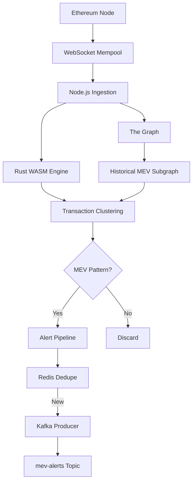

# MEV-Bot Detector with Real-Time Alert System

A high-performance, real-time MEV (Maximal Extractable Value) bot detection system that monitors Ethereum mempool transactions and identifies potential sandwich attacks and front-running patterns using Rust WASM for transaction clustering and Node.js for the backend service.

## 🏗️ Architecture



## 🚀 Features

- **Real-time Mempool Monitoring**: WebSocket connection to Ethereum nodes for pending transaction monitoring
- **Rust WASM Performance**: High-performance transaction clustering and MEV detection (1000+ TPS)
- **Sandwich Attack Detection**: Identifies transactions with high slippage tolerance between victim's buy/sell
- **Front-running Detection**: Detects bots consistently submitting transactions within 2 blocks of victims
- **Redis Deduplication**: 5-minute cache to avoid duplicate alerts
- **Kafka Alert Streaming**: Real-time alert distribution to downstream services
- **The Graph Integration**: Historical MEV pattern indexing and validation
- **Load Testing**: 10K TPS simulation for performance validation
- **REST API**: Health checks, statistics, and recent attacks endpoints

## 🛠️ Technology Stack

- **Backend**: Node.js with Express
- **Performance Engine**: Rust compiled to WebAssembly
- **Database**: Redis for caching and deduplication
- **Message Queue**: Apache Kafka for alert streaming
- **Blockchain Indexing**: The Graph Protocol
- **Monitoring**: Winston logging
- **Containerization**: Docker & Docker Compose

## 📋 Prerequisites

- Node.js 18+
- Rust 1.70+
- Docker & Docker Compose
- Redis
- Apache Kafka
- Ethereum node access (Infura, Alchemy, etc.)

## 🚀 Quick Start

### 1. Clone the Repository

```bash
git clone <repository-url>
cd mev-bot-detector
```

### 2. Environment Setup

Create a `.env` file in the root directory:

```env
ETHEREUM_WS_URL=wss://mainnet.infura.io/ws/v3/YOUR_PROJECT_ID
ETHEREUM_RPC_URL=https://mainnet.infura.io/v3/YOUR_PROJECT_ID
REDIS_URL=redis://localhost:6379
KAFKA_BROKERS=localhost:9092
PORT=3000
```

### 3. Build and Run with Docker

```bash
# Start all services (Redis, Kafka, Zookeeper, MEV Detector)
docker-compose up -d

# View logs
docker-compose logs -f mev-detector
```

### 4. Manual Setup (Alternative)

```bash
# Install dependencies
npm install

# Build Rust WASM module
npm run build:wasm

# Start Redis and Kafka (using Docker Compose)
docker-compose up -d redis kafka zookeeper

# Start the MEV detector
npm start
```

## 🧪 Load Testing

Run the load test to simulate 10K TPS mempool:

```bash
# Start the MEV detector first
npm start

# In another terminal, run the load test
npm run load-test
```

The load test will:
- Simulate 10,000 transactions per second
- Run for 5 minutes
- Monitor detection performance
- Display real-time statistics

## 📊 API Endpoints

### Health Check
```bash
GET /health
```
Returns system health status and uptime.

### Statistics
```bash
GET /stats
```
Returns real-time statistics including:
- Transactions processed
- Attacks detected
- Alerts sent
- Cluster count
- Pending transactions

### Recent Attacks
```bash
GET /attacks
```
Returns the last 10 detected MEV attacks.

### Mock Transaction (Load Testing)
```bash
POST /mock-transaction
Content-Type: application/json

{
  "hash": "0x...",
  "from": "0x...",
  "to": "0x...",
  "value": "1000000000000000000",
  "gas_price": "20000000000",
  "gas_limit": "21000",
  "nonce": 0,
  "data": "0x...",
  "timestamp": 1678901234,
  "block_number": null
}
```

## 🔍 MEV Detection Logic

### Sandwich Attack Detection

The system identifies sandwich attacks by analyzing:

1. **Transaction Ordering**: Three consecutive transactions (frontrun → victim → backrun)
2. **Sender Consistency**: Frontrun and backrun from same address
3. **Time Constraints**: All transactions within 2 minutes
4. **Gas Price Patterns**: Attacker pays higher gas than victim
5. **Swap Detection**: Victim transaction contains swap method signatures

```rust
fn detect_sandwich_attack(&self, transactions: &[Transaction]) -> Option<MEVAttack> {
    for i in 1..transactions.len() - 1 {
        let frontrun = &transactions[i - 1];
        let victim = &transactions[i];
        let backrun = &transactions[i + 1];
        
        if self.is_sandwich_pattern(frontrun, victim, backrun) {
            // Calculate profit and create alert
        }
    }
}
```

### Front-running Detection

Identifies front-running by analyzing:

1. **Transaction Timing**: Attacker transaction before victim (within 30 seconds)
2. **Gas Price Competition**: Attacker pays higher gas
3. **Swap Method Matching**: Both transactions are swaps
4. **Address Separation**: Attacker and victim are different addresses

## 📈 The Graph Subgraph

The subgraph indexes historical MEV attacks for pattern validation:

### Entities
- **MEVAttack**: Individual attack records
- **Transaction**: All monitored transactions
- **Attacker**: Aggregated attacker statistics
- **Victim**: Aggregated victim statistics
- **MEVStats**: Global statistics

### Deployment

```bash
cd subgraph

# Install dependencies
npm install

# Generate types
npm run codegen

# Build subgraph
npm run build

# Deploy to The Graph
npm run deploy
```

## 🔧 Configuration

### Environment Variables

| Variable | Description | Default |
|----------|-------------|---------|
| `ETHEREUM_WS_URL` | WebSocket URL for Ethereum node | Required |
| `ETHEREUM_RPC_URL` | HTTP RPC URL for Ethereum node | Required |
| `REDIS_URL` | Redis connection URL | `redis://localhost:6379` |
| `KAFKA_BROKERS` | Kafka broker addresses | `localhost:9092` |
| `PORT` | HTTP server port | `3000` |

### Performance Tuning

- **Batch Size**: Process 100 transactions per batch
- **Processing Interval**: 5 seconds between batches
- **Redis TTL**: 5 minutes for alert deduplication
- **Cluster Window**: 2-minute time windows for transaction clustering

## 📊 Monitoring

### Logs
Logs are written to `logs/mev-detector.log` with structured JSON format.

### Metrics
- Transactions processed per second
- MEV attacks detected
- Alert latency
- Redis cache hit rate
- Kafka message throughput

### Health Checks
The system provides health check endpoints for monitoring:
- `/health` - Overall system health
- `/stats` - Real-time performance metrics

## 🚨 Alert Schema

Kafka messages follow this schema:

```json
{
  "victim": "0x...",
  "attacker": "0x...",
  "profit_eth": 0.42,
  "timestamp": 1678901234,
  "attack_type": "sandwich",
  "frontrun_tx": "0x...",
  "backrun_tx": "0x..."
}
```

## 🔒 Security Considerations

- **Rate Limiting**: Implement rate limiting on API endpoints
- **Authentication**: Add API key authentication for production
- **Encryption**: Use TLS for all external communications
- **Monitoring**: Monitor for false positives and adjust detection logic
- **Privacy**: Be mindful of transaction data privacy

## 🧪 Testing

### Unit Tests
```bash
npm test
```

### Integration Tests
```bash
# Start test environment
docker-compose -f docker-compose.test.yml up -d

# Run integration tests
npm run test:integration
```

### Load Tests
```bash
npm run load-test
```

## 📝 Development

### Project Structure
```
mev-bot-detector/
├── src/                    # Node.js application
│   └── index.js           # Main application entry
├── rust/                   # Rust WASM module
│   ├── src/
│   │   └── lib.rs         # MEV detection logic
│   └── Cargo.toml
├── subgraph/              # The Graph subgraph
│   ├── src/
│   │   └── mapping.ts     # Event handlers
│   ├── schema.graphql     # GraphQL schema
│   └── subgraph.yaml      # Subgraph config
├── scripts/
│   └── load-test.js       # Load testing script
├── docker-compose.yml     # Infrastructure setup
└── README.md
```

### Adding New Detection Patterns

1. Add detection logic to `rust/src/lib.rs`
2. Update transaction clustering in `MEVEngine`
3. Add corresponding tests
4. Update The Graph schema if needed

## 🤝 Contributing

1. Fork the repository
2. Create a feature branch
3. Make your changes
4. Add tests
5. Submit a pull request

## 📄 License

MIT License - see LICENSE file for details

## 🆘 Support

For issues and questions:
- Create an issue on GitHub
- Check the documentation
- Review the logs for debugging

## 🔮 Future Enhancements

- [ ] Machine learning-based pattern detection
- [ ] Multi-chain support (Polygon, BSC, etc.)
- [ ] Advanced profit calculation
- [ ] Real-time dashboard
- [ ] Mobile alert notifications
- [ ] Integration with DeFi protocols
- [ ] Historical analysis tools 